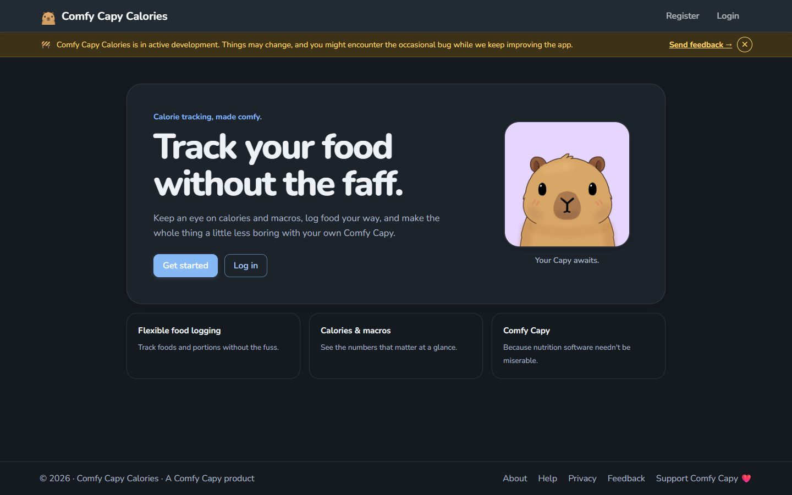
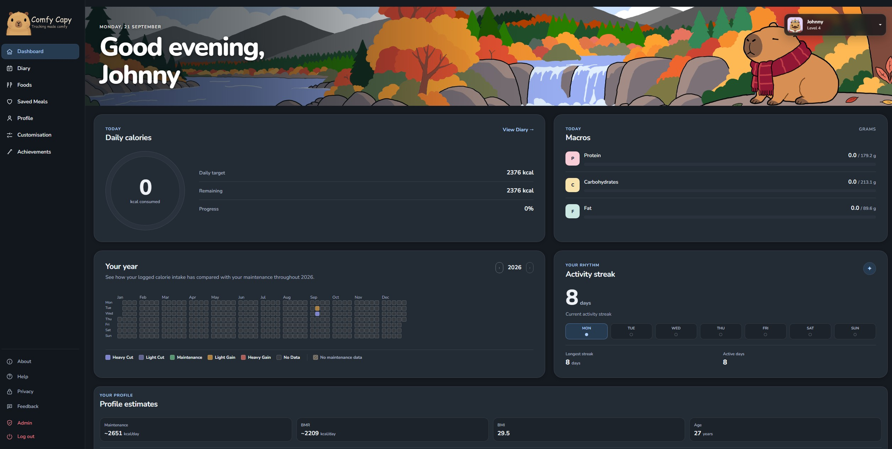
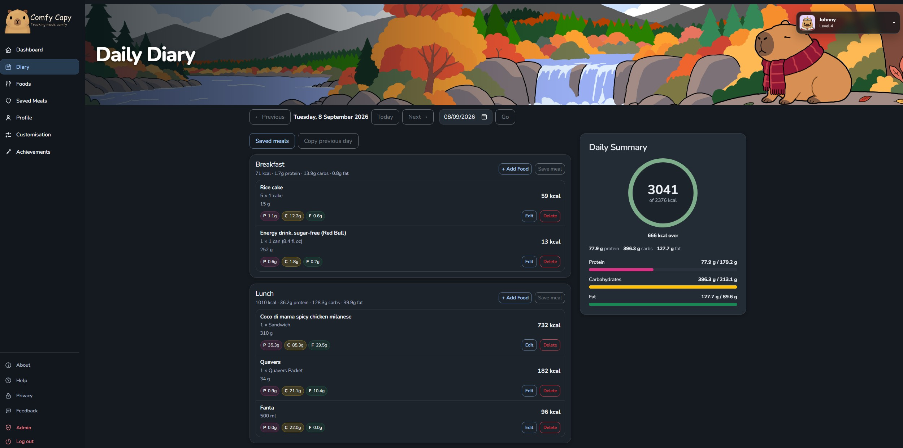
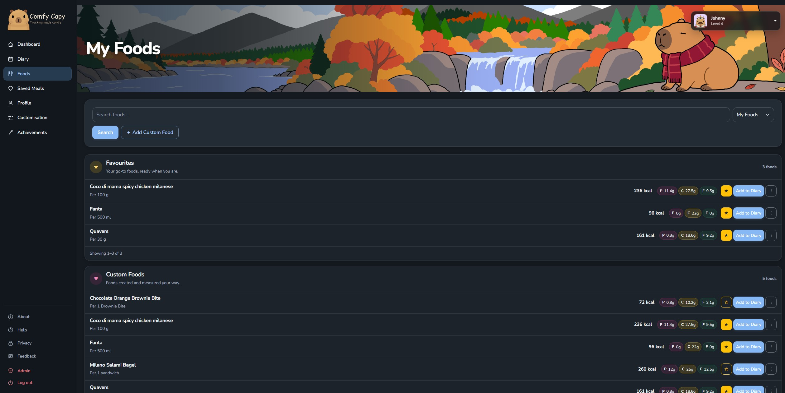
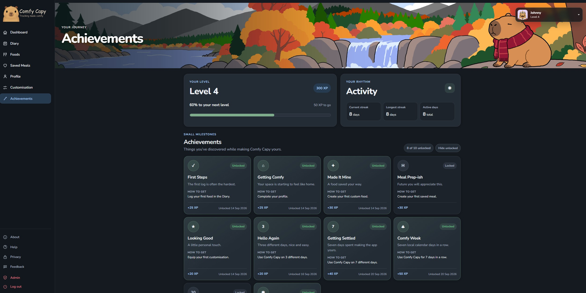
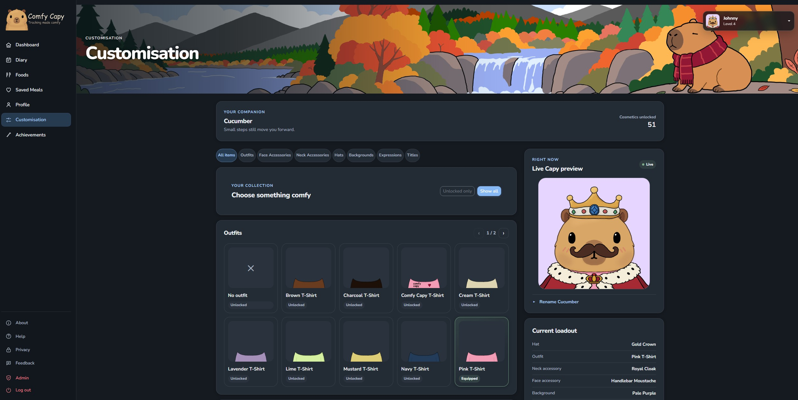

# Comfy Capy Calories

Comfy Capy Calories is the calorie and nutrition tracker I wanted to use myself: quick enough for everyday logging, careful with historical nutrition data, and a little less clinical thanks to a customisable capy companion.

**Live application:** [calories.comfycapy.com](https://calories.comfycapy.com/) 
**Status:** Live in production and under active development 
**Current production release:** [`c54afbe`](https://github.com/ComfyCapy/calorie-tracker/commit/c54afbe85107c1b87c9cd09dbc9b068f871f971d) 
**Core stack:** .NET 10 · ASP.NET Core Razor Pages · Entity Framework Core · SQLite · React 19 · Vite · Bootstrap

Comfy Capy Calories is intended for general nutrition tracking, not medical diagnosis or professional dietary advice.

## Product preview

  

<em>The live landing page — nutrition tracking with a calmer, friendlier personality.</em>

## Why I built it

Food logging already asks for enough attention. I wanted the common path to stay simple: find or create a food, log an exact amount or familiar portion, and understand the day at a glance. At the same time, the data model needed to handle the less visible details properly—unit conversion, changing food records, external data, account isolation and production-safe migrations.

The capy is more than decoration. Themes, progression, unlocks and layered cosmetics give the product some warmth without getting in the way of the nutrition workflow.

## What it does

### Dashboard and diary

The dashboard brings together daily calories and macros, profile-based estimates, a yearly calorie-balance heatmap and the same activity-streak data used by the achievement system. The diary keeps breakfast, lunch, dinner and snacks distinct, supports date navigation and stores historical nutrition snapshots so later food edits do not rewrite the past.

<table>
  <tr>
    <td align="center" width="50%">
       
      <em>Dashboard — daily progress, yearly patterns and activity streaks.</em>
    </td>
    <td align="center" width="50%">
       
      <em>Diary — meal sections, exact quantities and daily totals.</em>
    </td>
  </tr>
</table>

- Daily calorie, protein, carbohydrate and fat totals
- Exact-quantity and reusable-portion logging, including decimal portions
- Mass and volume conversions with a canonical stored quantity
- Copying a previous diary day into another date
- Saved meals that can be named, updated, reused and deleted
- Snapshot-based diary history that remains stable when source foods change

### Foods and search

Food discovery combines personal foods, a built-in UK CoFID catalogue, USDA FoodData Central and an approved community catalogue. External identifiers are resolved on the server; the browser does not get to supply authoritative nutrition values.

  

<em>Foods — favourites, custom entries, community foods and external catalogues in one workflow.</em>

- User-owned custom foods and reusable serving portions
- Embedded CoFID 2021 food data and live USDA FoodData Central search
- Per-user favourites and recently logged foods
- Moderated community submissions, voting and safe import into a user's own catalogue
- Soft deletion for user foods and portions so diary history remains meaningful
- Server-authoritative validation and cached external-food fallbacks

### Progress and achievements

Logging activity feeds a single progression system used across the dashboard and the Achievements page. Experience, levels, active days, current and longest streaks, and achievement unlocks are all derived from real application activity rather than display-only counters.

  

<em>Achievements — level progress, activity history and earned milestones.</em>

### Capy customisation

The avatar is composed from independent image layers, so clothing, accessories, hats, expressions and backgrounds can be combined without special-case artwork. The current seeded catalogue contains 51 cosmetics, with ownership and equipped state persisted per user.

  

<em>Customisation — layered cosmetics, independent category paging and a live equipped preview.</em>

- Outfits, face accessories, neck accessories, hats, backgrounds, expressions and titles
- Unlock and starter-inventory provisioning through the same catalogue model
- Live equip and unequip behaviour with persistent appearance
- Independent, client-side pagination for each category, showing nine items at a time
- Saved outfits that can be named, equipped and deleted
- Capy naming plus light, dark and system theme preferences

### Accounts, profile and support

- Username/email sign-in with confirmed accounts and lockout protection
- Email confirmation and password reset through Resend
- Authenticator-app two-factor authentication and recovery codes
- Metric or imperial profile entry with canonical metric storage
- Estimated calorie targets from profile, activity and weight-goal inputs, or a custom target
- Personal-data download and account deletion
- Anonymous feedback with endpoint-specific rate limiting

The screenshot set was captured from the live application without changing production data. Maintenance notes are in [`docs/screenshots/README.md`](docs/screenshots/README.md).

## Engineering decisions

### Preserve history, not just current state

Nutrition calculations use grams for mass and millilitres for volume while retaining the user's preferred display unit. Diary entries and saved meals keep snapshots of the food, serving basis, nutrition and selected portion used at logging time. Editing or removing a food later therefore does not silently change historical totals.

Calorie estimates use the Mifflin-St Jeor BMR formula, activity multipliers and an optional weekly weight-change adjustment. They are estimates for general tracking rather than medical recommendations.

### Keep external nutrition server-authoritative

The React search UI sends an external food identifier, not client-authored nutrition. The server fetches and validates the corresponding provider record before creating or refreshing the user's local copy. Existing cached foods remain usable during an upstream outage, while importing a new external food still requires a valid provider response.

### Add interactivity where it earns its keep

Most of the product remains server-rendered with Razor Pages, which keeps form validation, authentication and page-specific data access close to the business rules. React is used as a focused island for external food search, where loading, pagination and favourite state benefit from richer client-side interaction. Customisation's category pagination uses small, dependency-free JavaScript rather than introducing another frontend application.

### Treat ownership as a server-side boundary

- ASP.NET Core Identity cookie authentication with confirmed accounts, lockout and authenticator 2FA
- Current-user ownership checks for profiles, diary entries, foods, portions, saved meals, cached external foods and Capy data
- Role-based administration for community-food moderation
- Antiforgery validation for Razor forms and cookie-authenticated mutations
- Endpoint-specific rate limits for account operations, feedback and external search
- Production validation for connection strings, forwarded headers, email configuration and persistent Data Protection keys
- Security headers and HSTS in production

## Architecture

The production request path and the main in-process boundaries look like this:

~~~mermaid
flowchart LR
    subgraph Client["Client"]
        direction TB
        Browser["Browser server-rendered UI"]
        React["React food-search island app-served static bundle"]
        Browser -->|"runs on food-search pages"| React
    end

    subgraph Production["Production on Linux VM"]
        direction LR
        Caddy["Caddy HTTPS reverse proxy"]

        subgraph App["ASP.NET Core application (systemd service)"]
            direction TB
            Host["Request pipeline routing, security, rate limiting"]
            Razor["Razor Pages page models and views"]
            Identity["ASP.NET Core Identity cookies, roles, account UI"]
            FoodApi["Authenticated Foods API"]
            Core["Nutrition, diary and saved-meal services"]
            FoodServices["Food catalogue and external-food resolver"]
            Community["Community food service submission and moderation"]
            Personalisation["Customisation and progression provisioning, activity, achievements"]
            Email["Email service"]
        end
    end

    subgraph Data["Persistence and packaged data"]
        direction TB
        EfCore["Entity Framework Core application data and Identity stores"]
        SQLite[(SQLite)]
        CoFID["Embedded CoFID 2021 read-only catalogue"]
    end

    subgraph External["External services"]
        direction TB
        USDA["USDA FoodData Central"]
        Resend["Resend email API"]
    end

    Browser -->|"HTTPS page requests"| Caddy
    React -->|"authenticated JSON over HTTPS"| Caddy
    Caddy -->|"forwarded requests"| Host

    Host --> Razor
    Host --> Identity
    Host --> FoodApi
    Identity -.->|"authentication and roles"| Razor
    Identity -.->|"authentication"| FoodApi

    Razor --> Core
    Razor --> Community
    Razor --> Personalisation
    Razor --> Email
    Razor -->|"page-model queries"| EfCore
    FoodApi --> FoodServices
    FoodApi --> EfCore

    Core --> EfCore
    Community --> EfCore
    Personalisation --> EfCore
    Identity --> EfCore
    Identity --> Email
    FoodServices --> EfCore
    EfCore --> SQLite

    FoodServices --> CoFID
    FoodServices -->|"HTTPS"| USDA
    Email -->|"HTTPS"| Resend
~~~

The main code areas are:

- `CalorieTracker/Pages` — dashboard, diary, foods, saved meals, progress, profile, support and customisation
- `CalorieTracker/Areas/Identity` — customised Identity account and management pages
- `CalorieTracker/Controllers/FoodsApiController.cs` — authenticated endpoints used by the React search island
- `CalorieTracker/Services` — nutrition, catalogue, diary, progression, Capy, validation and email boundaries
- `CalorieTracker/Data`, `Models` and `Migrations` — EF Core model and checked-in SQLite migration history
- `CalorieTracker/ClientApp` — React/Vite source; its production bundle is committed under `wwwroot/react-food-search`
- `CalorieTracker.Tests` — unit, page-model, migration and integration coverage

## Technology stack

| Area | Technology |
| --- | --- |
| Backend | C#, .NET 10, ASP.NET Core, Razor Pages |
| Authentication | ASP.NET Core Identity |
| Data | Entity Framework Core 10, SQLite |
| Interactive UI | React 19, JavaScript, Vite 8 |
| Styling | Bootstrap and application-specific HTML/CSS |
| Data and email | CoFID 2021, USDA FoodData Central, Resend |
| Testing | xUnit, ASP.NET Core integration testing, SQLite test databases |
| Production | Linux VM, Caddy, systemd |

## Running it locally

### Prerequisites

- [.NET 10 SDK](https://dotnet.microsoft.com/download/dotnet/10.0)
- EF Core CLI 10.x (`dotnet-ef`) for applying migrations
- A USDA FoodData Central API key for USDA search
- A Resend API key and verified sender to exercise email flows
- Node.js and npm only when changing or rebuilding the React island

### 1. Clone and restore

~~~bash
git clone https://github.com/ComfyCapy/calorie-tracker.git
cd calorie-tracker
dotnet restore CalorieTracker/CalorieTracker.slnx
~~~

If the EF Core CLI is not installed:

~~~bash
dotnet tool install --global dotnet-ef --version 10.0.11
~~~

### 2. Add local secrets

The project uses .NET user secrets, so local credentials do not need to be written into tracked configuration:

~~~bash
dotnet user-secrets set "FoodDataCentral:ApiKey" "<your-usda-api-key>" --project CalorieTracker/CalorieTracker.csproj
dotnet user-secrets set "Resend:ApiKey" "<your-resend-api-key>" --project CalorieTracker/CalorieTracker.csproj
dotnet user-secrets set "Resend:FromAddress" "Comfy Capy Calories <noreply@your-verified-domain.example>" --project CalorieTracker/CalorieTracker.csproj
dotnet user-secrets set "Feedback:RecipientAddress" "<your-feedback-inbox>" --project CalorieTracker/CalorieTracker.csproj
~~~

No production credentials are stored in the repository. Development configuration supplies only a local SQLite connection string.

### 3. Create the database

~~~bash
dotnet ef database update --project CalorieTracker/CalorieTracker.csproj
~~~

This applies the checked-in migrations and seeds the system cosmetic catalogue. New accounts receive their starter Capy inventory through the normal provisioning path.

### 4. Run the application

~~~bash
dotnet run --project CalorieTracker/CalorieTracker.csproj --launch-profile https
~~~

The HTTPS launch profile uses `https://localhost:7259` and also listens on `http://localhost:5074`. A working email configuration is needed to exercise the complete registration and recovery flows.

If the React source changes, keep its committed production bundle in sync:

~~~bash
cd CalorieTracker/ClientApp
npm ci
npm run lint
npm run build
~~~

The .NET build does not automatically rebuild the React island.

## Configuration

| Configuration key | Purpose | Required? |
| --- | --- | --- |
| `ConnectionStrings:DefaultConnection` | SQLite connection string | Always; development has a local value |
| `FoodDataCentral:ApiKey` | USDA search and food details | For USDA features |
| `Resend:ApiKey` | Account and feedback email delivery | For email flows |
| `Resend:FromAddress` | Verified sender used by Resend | For email flows |
| `Feedback:RecipientAddress` | Destination for anonymous feedback | For feedback delivery |
| `ReverseProxy:KnownProxies` | Explicit allow-list for forwarded headers | Behind a trusted reverse proxy |
| `DataProtection:KeysPath` | Persistent ASP.NET Core keyring directory | Production |

Environment variables use .NET's double-underscore separator, for example `ConnectionStrings__DefaultConnection`. Connection strings, API credentials, email settings and production Data Protection keys must remain outside source control.

## Testing

~~~bash
dotnet build CalorieTracker/CalorieTracker.slnx
dotnet test CalorieTracker/CalorieTracker.slnx
~~~

The current production release was validated with **713 passing automated tests**. Coverage includes:

- profile calculations and metric/imperial conversion
- serving-unit conversion, nutrition snapshots and diary transitions
- saved-meal creation, reuse and ownership boundaries
- personal, CoFID, USDA and community-food workflows
- progression, achievements, activity streaks and Capy provisioning
- cosmetic catalogue, equip persistence and saved outfits
- Identity, account deletion, antiforgery and cross-account isolation
- migrations from a fresh database and upgrades from released schemas
- production configuration and release-readiness checks

The repository also includes [`MANUAL-TESTING.md`](MANUAL-TESTING.md), covering browser, accessibility, theme, account, isolation and deployment smoke testing.

## Production and release process

The live application runs on a Linux VM behind Caddy, with systemd supervising the ASP.NET Core process. SQLite data, Data Protection keys and environment configuration live outside the versioned release directory.

Production releases follow the existing checked-in workflow:

1. `scripts/Publish-Release.ps1` creates a clean Release publish and ZIP for `linux-x64`, and rejects database files, secrets, development configuration or missing required assets.
2. The package is transferred to the server and validated/extracted by `scripts/extract-release.sh`, including archive-path and forbidden-file checks.
3. The production database is backed up and checked before pending migrations are applied explicitly with the generated EF Core migration bundle.
4. The release is activated by updating the `current` symlink, then restarting the systemd service.
5. HTTP and application-log smoke checks verify the new release; the previous release and database backup provide the rollback path.

The application deliberately does not call `Database.Migrate()` at startup. Keeping schema changes as an explicit release step avoids hidden migration failures and startup races. SQLite suits the current single-instance deployment; moving to multiple writers would require an intentional provider and data-migration project rather than an automatic configuration switch.

## Licensing and source availability

Comfy Capy Calories is publicly viewable as a portfolio project, but it is not open-source software. The original source code and Comfy Capy artwork are copyright © 2026 John Gambino. All rights reserved.

Viewing and evaluation are permitted, but reuse, modification, redistribution or commercial use of original project materials requires prior written permission. Third-party components remain subject to their respective licences. See [LICENSE.md](LICENSE.md) and [THIRD-PARTY-NOTICES.md](THIRD-PARTY-NOTICES.md).

## Current status

- **Production:** The application is live at [calories.comfycapy.com](https://calories.comfycapy.com/).
- **Release:** Production currently runs commit [`c54afbe`](https://github.com/ComfyCapy/calorie-tracker/commit/c54afbe85107c1b87c9cd09dbc9b068f871f971d).
- **Quality:** The release passed 713 automated tests plus production smoke checks.
- **Roadmap:** Saved meals are implemented. Broader recipe authoring and body-weight history remain possible future work rather than current features.

Comfy Capy Calories is the first product under the broader **Comfy Capy** brand. The internal `CalorieTracker` project and namespace names remain unchanged intentionally.
