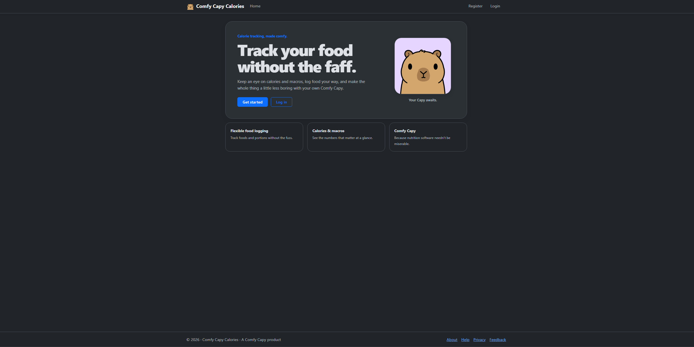
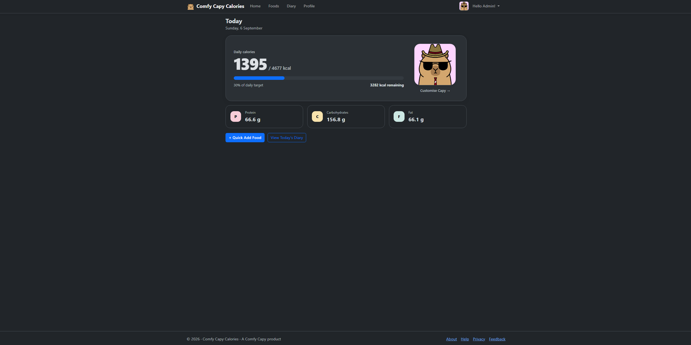
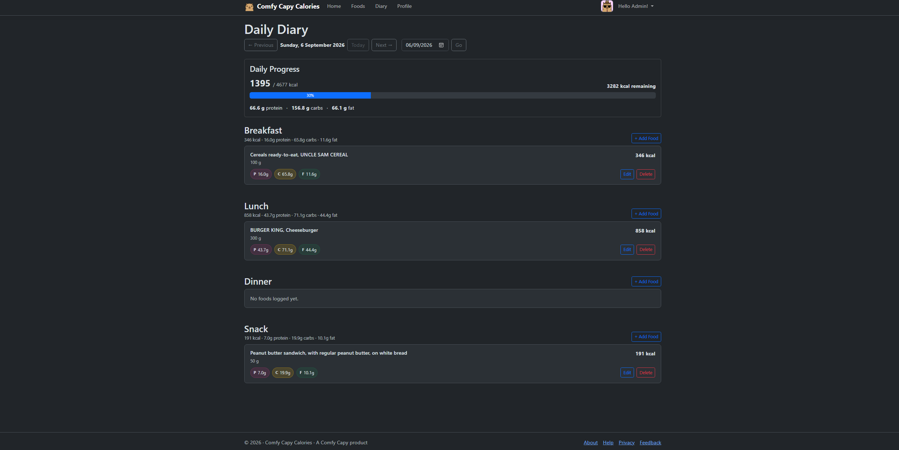
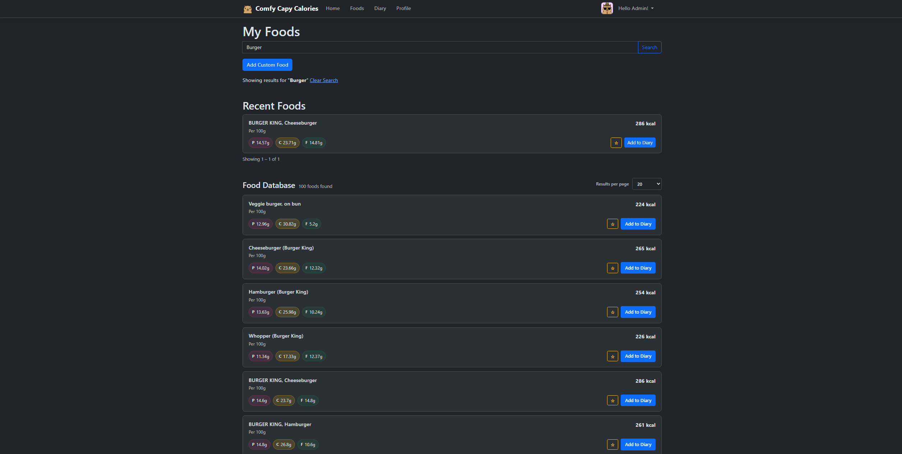
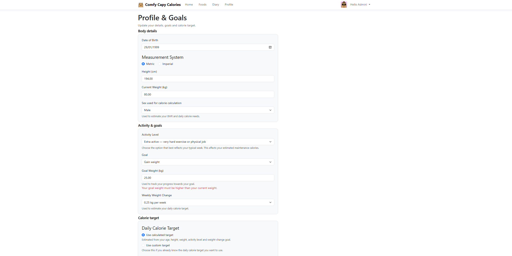
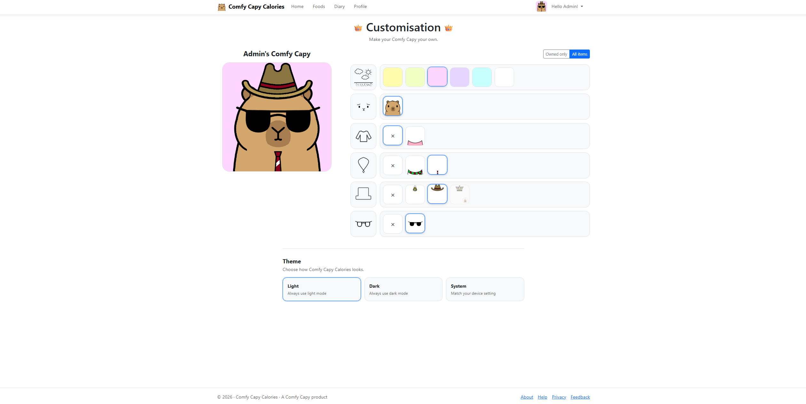

# Comfy Capy Calories

Comfy Capy Calories is a full-stack calorie and nutrition tracker I built to make tracking what you eat a little less painful. It keeps the useful stuff you actually want from a nutrition tracker, tries to cut down on the faff that usually comes with logging food, and gives you a customisable Capy companion along the way. It is built for general nutrition tracking, not as a medical or professional nutrition tool.

**Project status:** MVP nearly ready for deployment 
**Live demo:** Coming soon 
**Core stack:** .NET 10 · ASP.NET Core Razor Pages · Entity Framework Core · SQLite · React 19 · Vite · Bootstrap

## Product preview

Here's what the app currently looks like. The screenshots use demo data and show both the light and dark themes.

  

<em>Landing page — a quick introduction to the product.</em>

<table>
  <tr>
    <td align="center" width="50%">
       
      <em>Dashboard — daily calories, target progress and macros.</em>
    </td>
    <td align="center" width="50%">
       
      <em>Diary — meal sections, totals and date navigation.</em>
    </td>
  </tr>
  <tr>
    <td align="center" width="50%">
       
      <em>USDA search — React-powered results and favourites.</em>
    </td>
    <td align="center" width="50%">
       
      <em>Profile &amp; goals — personal details and calorie-target controls.</em>
    </td>
  </tr>
</table>

  

<em>Capy customisation — preview, filters and cosmetic categories.</em>

The screenshot maintenance notes are in [`docs/screenshots/README.md`](docs/screenshots/README.md).

## Why I built it

Nutrition tracking can already be tedious, so I didn't want the app to make it harder. I've used calorie trackers myself and wanted to make the everyday workflow easier: find or create a food, log an exact amount or a familiar portion, and understand the day's calories and macronutrients at a glance.

I also wanted the experience to feel a bit less clinical, so themes, customisation and the Capy are part of the product rather than afterthoughts.

Building it gave me the opportunity to solve some interesting engineering problems:

- converting between different units without losing accuracy
- preserving historical diary accuracy when foods change
- handling third-party USDA data safely, including cached fallbacks
- keeping each user's data properly isolated
- deciding where React genuinely adds value

## Features

### Nutrition and diary

- Daily diary split into breakfast, lunch, dinner and snacks
- Exact-quantity and saved-portion logging, including decimal portion counts
- Daily calorie, protein, carbohydrate and fat totals
- Date navigation across the supported diary range
- Historical snapshots of food names, serving bases, nutrition and portion labels
- Dashboard summary with calorie progress and macronutrient totals

### Foods

- User-owned custom foods with editable serving bases
- Mass units (`g`, `kg`, `oz`, `lb`) and volume units (`ml`, `L`, US `fl oz`)
- Reusable custom portions that inherit a food's preferred display unit
- USDA FoodData Central search through a React interface
- Server-resolved USDA nutrition, per-user favourites and recently logged foods
- Soft deletion of foods and portions so existing diary history remains meaningful

### Profile and personalisation

- Metric and imperial profile entry with canonical metric storage
- Calculated calorie targets using profile, activity and weight-goal data, or a custom daily target
- Light, dark and system theme preferences
- Layered Comfy Capy avatar with starter inventory, cosmetic unlocking and equipped appearance

### Accounts and support

- Username/email login, email confirmation and password reset
- Authenticator-app two-factor authentication and recovery codes
- Account settings, personal-data download and account deletion
- Anonymous feedback form delivered through Resend

## How it works

### Measurement and historical-data integrity

If someone changes a food later, that should not change what they logged in the past. To make that work, nutrition calculations use grams for mass and millilitres for volume while retaining the user's preferred display unit. Diary entries store the canonical logged quantity plus a snapshot of the food and portion values used at logging time, so editing or soft-deleting a food later does not rewrite past nutrition.

For calorie estimates, I use the Mifflin-St Jeor BMR formula, activity multipliers and an optional weekly weight-change adjustment. These values are estimates for general tracking, not medical advice.

### USDA integration and caching

The React/browser side only sends a USDA identifier; it never gets to tell the server what that food's nutrition values are. The server resolves the identifier itself, fetching and validating the current FoodData Central record before creating or refreshing the user's local copy. If USDA later becomes unavailable or removes a food, that user's existing cached copy can still be used; new external foods require a successful upstream fetch. Existing diary snapshots never depend on a later USDA response.

### Security and user boundaries

- ASP.NET Core Identity cookie authentication with confirmed accounts, lockout, password reset and authenticator 2FA
- Authorised Razor Pages and a centrally protected Identity account-management area
- Current-user ownership checks for profiles, diary entries, custom foods, portions, cached external foods and Capy state
- Antiforgery validation on Razor forms and cookie-authenticated food API mutations
- Server-authoritative external-food resolution rather than trusting browser-supplied nutrition
- Endpoint-specific rate limits for account operations, anonymous feedback and USDA search
- Production startup validation for the database connection string and explicit trusted-proxy configuration
- Secret-file patterns excluded from source control; credentials are supplied through configuration providers

None of that makes the app magically "secure forever", but it gives the current application sensible boundaries instead of relying on the browser or a well-behaved user to do the right thing.

## Architecture

I kept the application primarily server-rendered with ASP.NET Core Razor Pages. That keeps forms, validation, authentication and page-specific data access close to the server-side business rules, which suits the way most of the app works.

I brought React in as a focused **island** where it genuinely helps: the USDA search benefits from client-side state for loading, pagination and favourite interactions. It calls an authenticated ASP.NET Core API; USDA credentials and nutrition resolution remain on the server. I didn't convert the whole application to a SPA just for the sake of using React, because that would add complexity without improving its mostly form-and-navigation-driven workflows.

~~~mermaid
flowchart LR
    Browser --> Razor["Razor Pages + Identity UI"]
    Browser --> React["React USDA search island"]
    React --> FoodApi["Authenticated Foods API"]
    Razor --> Services["Application services"]
    FoodApi --> Services
    Services --> EfCore["Entity Framework Core"]
    EfCore --> SQLite[(SQLite)]
    Services --> USDA["USDA FoodData Central"]
    Services --> Resend["Resend email API"]
~~~

If you're digging through the code, the main areas are:

- `CalorieTracker/Pages` — Razor Pages for the dashboard, diary, foods, profile, feedback and Capy customisation
- `CalorieTracker/Areas/Identity` — customised ASP.NET Core Identity account and management pages
- `CalorieTracker/Controllers/FoodsApiController.cs` — authenticated API used by the React food-search island
- `CalorieTracker/Services` — measurement, external-food, recent-food, Capy provisioning, validation and email boundaries
- `CalorieTracker/Data`, `Models` and `Migrations` — EF Core model and checked-in SQLite migration history
- `CalorieTracker/ClientApp` — React/Vite source; production output is committed under `wwwroot/react-food-search`
- `CalorieTracker.Tests` — xUnit unit, page-model and integration coverage

## Technology stack

| Area | Technology |
| --- | --- |
| Backend | C#, .NET 10, ASP.NET Core, Razor Pages |
| Authentication | ASP.NET Core Identity |
| Data | Entity Framework Core 10, SQLite |
| Interactive UI | React 19, JavaScript, Vite 8 |
| Styling | Bootstrap, application-specific HTML/CSS |
| Integrations | USDA FoodData Central API, Resend |
| Testing | xUnit, ASP.NET Core integration testing, EF Core SQLite test databases |
| Workflow | Git and GitHub |

## Running it locally

### Prerequisites

- [.NET 10 SDK](https://dotnet.microsoft.com/download/dotnet/10.0)
- EF Core CLI 10.x (`dotnet-ef`) for applying migrations
- A USDA FoodData Central API key for external food search
- A Resend API key and verified sender when exercising email-based account flows
- Node.js and npm only when changing or rebuilding the React island

### 1. Clone and restore

~~~bash
git clone https://github.com/ComfyCapy/calorie-tracker.git
cd calorie-tracker
dotnet restore CalorieTracker/CalorieTracker.slnx
~~~

If the EF Core CLI is not already installed:

~~~bash
dotnet tool install --global dotnet-ef --version 10.0.11
~~~

### 2. Add local secrets

The project has a `UserSecretsId`, so local credentials can be configured without editing tracked files:

~~~bash
dotnet user-secrets set "FoodDataCentral:ApiKey" "<your-usda-api-key>" --project CalorieTracker/CalorieTracker.csproj
dotnet user-secrets set "Resend:ApiKey" "<your-resend-api-key>" --project CalorieTracker/CalorieTracker.csproj
dotnet user-secrets set "Resend:FromAddress" "Comfy Capy Calories <noreply@your-verified-domain.example>" --project CalorieTracker/CalorieTracker.csproj
dotnet user-secrets set "Feedback:RecipientAddress" "<your-feedback-inbox>" --project CalorieTracker/CalorieTracker.csproj
~~~

No real credentials are included in the repository. The development configuration supplies only a local SQLite connection string.

### 3. Create the database

~~~bash
dotnet ef database update --project CalorieTracker/CalorieTracker.csproj
~~~

This runs the checked-in migration history and seeds the system Capy catalogue. The app then gives new users their starter Capy appearance and inventory when their account is provisioned.

### 4. Run the application

~~~bash
dotnet run --project CalorieTracker/CalorieTracker.csproj --launch-profile https
~~~

The HTTPS launch profile uses `https://localhost:7259` (and also listens on `http://localhost:5074`). Account sign-in requires email confirmation, so a working development email configuration is needed to exercise the complete registration flow.

## Configuration reference

| Configuration key | Purpose | Required? |
| --- | --- | --- |
| `ConnectionStrings:DefaultConnection` | SQLite connection string | Always; a local development value is already provided |
| `FoodDataCentral:ApiKey` | USDA search and food-detail requests | For external food features |
| `Resend:ApiKey` | Account and feedback email delivery | For email flows |
| `Resend:FromAddress` | Verified sender used by Resend | Override when the configured default is not verified for your account |
| `Feedback:RecipientAddress` | Destination for anonymous feedback | For feedback delivery |
| `ReverseProxy:KnownProxies` | Explicit IP allow-list for forwarded headers | Only behind a trusted reverse proxy |
| `DataProtection:KeysPath` | Persistent ASP.NET Core keyring directory | Production |

In environment variables, .NET configuration separators use double underscores, for example `ConnectionStrings__DefaultConnection` and `FoodDataCentral__ApiKey`. Keep connection strings, API credentials, email settings and production ASP.NET Core data-protection keys outside source control.

On Linux, the configured Data Protection directory must be owned by the
application service account with mode `0700`; key files must remain mode
`0600` (a systemd `UMask=0077` keeps newly written keys restrictive). The
production environment file must remain owned by `root` with mode `0600`.
Verify metadata without printing secret contents:

~~~bash
sudo stat -c '%a %U:%G %n' /srv/comfycapy/dataprotection
sudo find /srv/comfycapy/dataprotection -maxdepth 1 -type f -name '*.xml' -printf '%m %u:%g %p\n'
sudo stat -c '%a %U:%G %n' /path/to/comfycapy.env
~~~

## Database and deployment notes

SQLite is the current persistence provider. For local development, the app uses the ignored `calorietracker.db` file. For a first single-instance deployment, I would put the database on persistent storage and supply the production connection string externally.

I keep migrations as an explicit release step:

~~~bash
dotnet ef database update --project CalorieTracker/CalorieTracker.csproj
~~~

The application does not call `Database.Migrate()` at startup. That avoids hidden migration failures and migration races. Back up the production database before migration, retain recoverable backups, and use SQLite's online backup mechanism or a platform volume snapshot rather than copying a live file while writes are happening.

If the app ever needs multiple instances or materially higher write concurrency, I would move to a managed database such as PostgreSQL as a separate piece of work. That would need an intentional provider, migration and data-transfer plan; it is not implemented in this repository.

## Testing

The project has an automated xUnit suite alongside a manual release checklist. From the repository root:

~~~bash
dotnet build CalorieTracker/CalorieTracker.slnx
dotnet test CalorieTracker/CalorieTracker.slnx
~~~

The automated tests cover the bits I most don't want silently breaking:

- profile calculations and metric/imperial conversion
- canonical serving-unit conversion and diary nutrition snapshots
- exact/portion diary transitions and deleted historical data
- user ownership and cross-account isolation
- custom-food history rules and USDA cache/fallback behaviour
- authenticated food API behaviour and antiforgery enforcement
- Identity/authenticator, Capy provisioning and feedback flows
- fresh-database migrations and relational uniqueness constraints

The repository also includes a detailed [`MANUAL-TESTING.md`](MANUAL-TESTING.md) release checklist for browser, accessibility, theme, account, isolation and deployment smoke testing.

If the React source changes, its committed production build needs to be kept in sync:

~~~bash
cd CalorieTracker/ClientApp
npm ci
npm run lint
npm run build
~~~

The .NET build doesn't automatically rebuild the React island.

## Project status

- **Deployment:** Not public just yet; a live demo is coming soon.
- **Screenshots:** Final PNG gallery captured under `docs/screenshots/`.
- **Artwork:** The current Capy layers and small brand mark are original project integration assets. Their stable paths allow future commissioned artwork to replace them without changing application behaviour.
- **Future scope:** Recipes/saved meals and weight tracking are not part of the current MVP.

Comfy Capy Calories is the first product under the broader **Comfy Capy** brand. The internal `CalorieTracker` project and namespace names remain unchanged intentionally.
